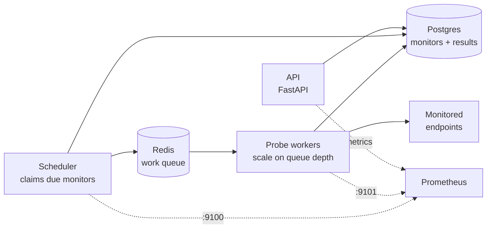

# Sentinel
A self-hosted uptime and SLO monitoring platform. Register HTTP endpoints and
Sentinel probes them on a schedule, records every result, and reports
availability, latency percentiles, error budgets and burn rate.
It also monitors itself, which is why it exposes its own Prometheus metrics.
> **Why this project exists**
> It is a platform engineering portfolio built deliberately in the SRE problem
> domain, so the application vocabulary (SLI, SLO, error budget, burn rate) is
> the same vocabulary used to operate it. Total infrastructure cost is kept
> under about $20 — see
> [ADR 0002](docs/adr/0002-run-on-local-kind-and-k3s-instead-of-managed-kubernetes.md).
## Architecture

Three processes, deliberately separated so each can be scaled and reasoned about
independently:
- **api** — HTTP interface, monitor CRUD, SLO reporting, `/metrics`.
- **scheduler** — finds monitors whose `next_run_at` has passed and enqueues one
  job each. Safe to run as multiple replicas via `SELECT ... FOR UPDATE SKIP LOCKED`.
- **worker** — pops jobs, performs the HTTP probe, writes the result. This is the
  horizontally scalable component; queue depth is the autoscaling signal.
## Quickstart
Requires Docker and Docker Compose.
```bash
git clone https://github.com/hertheyhermee/sentinel.git
cd sentinel
make up        # build and start the whole stack
make smoke     # prove the pipeline works end to end
```
Then open:
- http://localhost:8000/docs — interactive API documentation
- http://localhost:8000/metrics — Prometheus metrics
Create a monitor:
```bash
curl -X POST http://localhost:8000/api/monitors \
  -H 'Content-Type: application/json' \
  -d '{"name":"example","url":"https://example.com","interval_seconds":30}'
```
Read its SLO report:
```bash
curl http://localhost:8000/api/monitors/1/slo | python3 -m json.tool
```
Scale the probe workers:
```bash
make scale     # runs 3 workers
```
## Local development
```bash
make venv      # python 3.12 virtualenv + dev dependencies
make hooks     # install pre-commit hooks
make check     # lint + format check + tests with coverage gate
```
`make help` lists every target.
## API
| Method | Path | Purpose |
| --- | --- | --- |
| `POST` | `/api/monitors` | Create a monitor |
| `GET` | `/api/monitors` | List monitors |
| `GET` | `/api/monitors/{id}` | Get one monitor |
| `PATCH` | `/api/monitors/{id}` | Update a monitor |
| `DELETE` | `/api/monitors/{id}` | Delete a monitor and its results |
| `GET` | `/api/monitors/{id}/results` | Recent probe samples |
| `GET` | `/api/monitors/{id}/slo` | Availability, error budget, percentiles |
| `GET` | `/health` | Liveness — no dependency checks |
| `GET` | `/ready` | Readiness — verifies Postgres and Redis |
| `GET` | `/metrics` | Prometheus exposition |
## Design notes
**Liveness and readiness are different endpoints.** `/health` never touches
Postgres or Redis. If it did, a brief database blip would make Kubernetes restart
every pod and turn a recoverable dependency problem into a full outage. `/ready`
does check dependencies, so an unhealthy pod is pulled from the Service
endpoints and returns automatically once its dependencies recover.
**The scheduler uses `SKIP LOCKED`.** Due monitors are claimed and rescheduled
inside one transaction, so running multiple scheduler replicas cannot produce
duplicate probes and replicas do not serialise behind each other.
**Queue depth is the scaling signal, not CPU.** Probing is IO-bound, so CPU
barely moves under load and would be a useless HPA trigger. `sentinel_queue_depth`
directly represents backlog.
**Failed probes are excluded from latency percentiles.** Including timeout
durations as if they were response times would make p99 latency improve during
an outage, which is exactly backwards.
**Metric labels are kept low-cardinality.** Labelling by `monitor_id` is bounded;
labelling by URL is how teams accidentally overwhelm Prometheus.
## Roadmap
Built in phases, each ending with working, verifiable evidence:
- **Phase 1** — application, Docker Compose, migrations, tests ✅
- **Phase 2** — CI/CD: GHCR images, SBOMs, image signing, Trivy gate
- **Phase 3** — Kubernetes on `kind`: manifests, then Helm, ingress, HPA
- **Phase 4** — Terraform modules, plan-on-PR, policy scanning
- **Phase 5** — Prometheus, Grafana, Loki, Tempo, SLO burn-rate alerts, runbooks
- **Phase 6** — Argo CD GitOps on k3s, canary rollouts, backup/restore drills
## Repository layout
```
libs/sentinel_core/   shared domain code (models, queue, probe, SLO maths)
services/api/         FastAPI service
services/scheduler/   enqueues due checks
services/worker/      executes probes
migrations/           Alembic migrations
tests/                unit tests (no external services required)
scripts/              seed and smoke helpers
docs/adr/             architecture decision records
```
## License
MIT — see [LICENSE](LICENSE).
